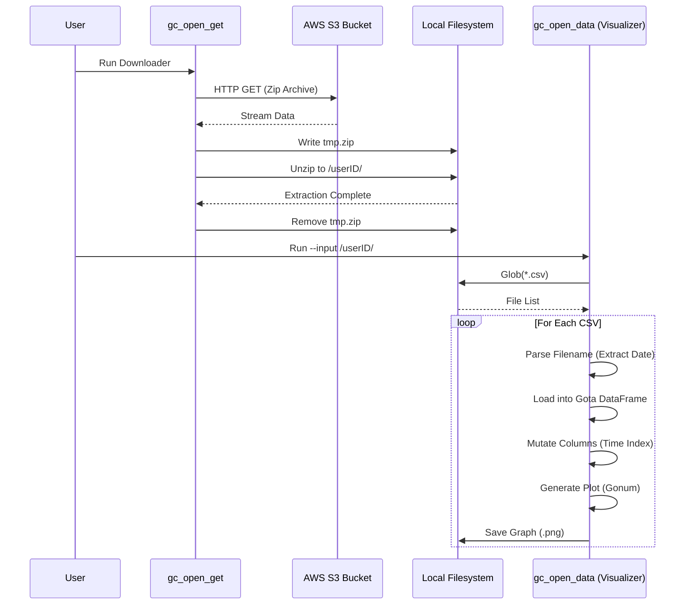

# jdc.code.learn.golang

Welcome to my personal Go (Golang) learning repository! 🚀

This repository serves as a central hub for my journey into the Go ecosystem, documenting everything from basic syntax and idiomatic patterns to advanced data engineering pipelines and visualization tools. It contains code from various tutorials, books, courses, and my own experiments.

## 📂 Project Structure

Here is a high-level overview of the repository's organization:

```text
jdc.code.learn.golang/
├── computer-science-principles/   # Theoretical notes and concepts
├── exercises/                     # Practical projects & coding exercises
│   └── data_engineering/          # Data pipelines, CLI tools, and analysis
├── gophercises/                   # Solutions from the "Gophercises" course
├── learning-go-.../               # Code from "Learning Go" (O'Reilly)
├── notes/                         # Miscellaneous study notes
├── tour-of-go/                    # Progress from the official "A Tour of Go"
├── tutorials-alex-mux/            # Tutorial projects
├── tutorials-code-with-ryan/      # Deep dives into Channels, Context, Interfaces
└── udemy-complete-dev-guide/      # Assignments from Stephen Grider's course
```

---

## 🌟 Feature Highlight: Data Engineering with Go

One of the key practical applications in this repo is the `exercises/data_engineering` module, which implements a mini-ETL pipeline for **Golden Cheetah Open Data**.

### The Pipeline
I've built tools to automate the retrieval and analysis of cycling/athletic data:

1.  **`gc_open_get`**: A robust downloader that fetches compressed data sets directly from AWS S3, handles file I/O streams, and unzips content locally.
2.  **`gc_open_data`**: A data processing CLI that:
    *   Scans directories for CSV files.
    *   Uses **[Gota](https://github.com/go-gota/gota)** (Pandas for Go) to create DataFrames.
    *   Parses timestamps and creates time-series indices.
    *   Uses **[Gonum/plot](https://github.com/gonum/plot)** to generate visualizations (e.g., Altitude over Time).

### Workflow Visualization



---

## 📚 Learning Resources Tracked

This repository aggregates knowledge from several high-quality sources:

| Source | Focus Area | Directory |
| :--- | :--- | :--- |
| **A Tour of Go** | Syntax, Basics, Slices, Maps | `tour-of-go/` |
| **Gophercises** | Practical Apps, CLI tools | `gophercises/` |
| **Learning Go (Book)** | Idiomatic Go, Modules, Types | `learning-go-.../` |
| **Code with Ryan** | Concurrency, Interfaces, Context | `tutorials-code-with-ryan/` |
| **Udemy (Stephen Grider)** | Core Logic, Testing, Structs | `udemy-the_complete_developers_guide/` |

---

## 🛠️ Tech Stack & Libraries

*   **Standard Library**: `fmt`, `os`, `io`, `net/http`, `archive/zip`, `flag`, `path/filepath`.
*   **Data Analysis**: `github.com/go-gota/gota` (DataFrames, Series).
*   **Visualization**: `gonum.org/v1/plot` (Plotting, Plotters).
*   **Concurrency**: Goroutines, Channels, WaitGroups (explored in tutorials).

---

_This repository is constantly evolving as I learn new patterns and libraries in Go._
