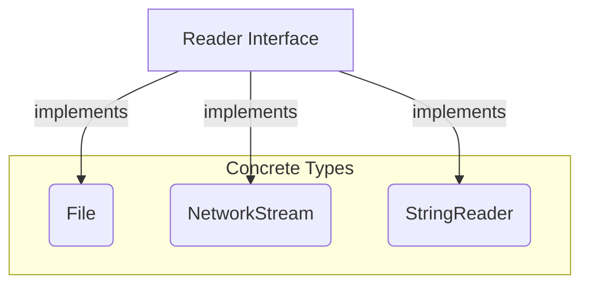

# Go Interfaces for Python Developers

Welcome! As a Python developer, you're used to the flexibility of dynamic typing and "duck typing." In Go, interfaces provide a powerful way to achieve similar flexibility while maintaining the safety of a statically typed language. This guide will walk you through Go interfaces, from the basics to more advanced concepts, with examples tailored to a data engineering context.

## What are Interfaces?

In Go, an interface is a type that defines a set of method signatures. It's a contract that says "any type that has these methods is also of this interface type."

Think of it like this: in Python, you might have a function that expects an object with a `.read()` method. You don't care what *type* of object it is, as long as it has that method.

```python
def process_data(reader):
  data = reader.read()
  # ... process data
```

In Go, you can create an interface to formally define this contract:

```go
type Reader interface {
  Read() []byte
}
```

Any type that has a `Read() []byte` method implicitly "implements" the `Reader` interface.

### Mermaid Diagram: Interface Implementation



## Basic Interface Implementation

Let's look at a simple example. We'll define a `Shape` interface and a few structs that implement it.

```go
package main

import (
  "fmt"
  "math"
)

// Shape is an interface for things that have an area.
type Shape interface {
  Area() float64
}

// Circle is a circle.
type Circle struct {
  Radius float64
}

// Area calculates the area of a circle.
func (c Circle) Area() float64 {
  return math.Pi * c.Radius * c.Radius
}

// Rectangle is a rectangle.
type Rectangle struct {
  Width  float64
  Height float64
}

// Area calculates the area of a rectangle.
func (r Rectangle) Area() float64 {
  return r.Width * r.Height
}

// PrintArea prints the area of a shape.
func PrintArea(s Shape) {
  fmt.Printf("Area: %f\n", s.Area())
}

func main() {
  c := Circle{Radius: 5}
  r := Rectangle{Width: 10, Height: 3}

  PrintArea(c)
  PrintArea(r)
}
```

In this example, both `Circle` and `Rectangle` have an `Area() float64` method, so they both satisfy the `Shape` interface. The `PrintArea` function can accept any `Shape`, making the code flexible and extensible.

## The Empty Interface: `interface{}`

The empty interface, `interface{}`, is a special interface that has no methods. Since every type has zero or more methods, every type satisfies the empty interface. This means you can use `interface{}` to hold a value of any type.

This is the closest you'll get to Python's dynamic typing in Go.

```go
package main

import "fmt"

func Describe(i interface{}) {
  fmt.Printf("Type: %T, Value: %v\n", i, i)
}

func main() {
  Describe(42)
  Describe("hello")
  Describe(true)
}
```

While powerful, the empty interface should be used with caution. It removes the safety of static typing, so you lose compile-time checks.

## Type Assertions and Type Switches

When you have a value of type `interface{}`, you often need to get back to the original concrete type to do anything useful with it. This is where type assertions and type switches come in.

### Type Assertions

A type assertion provides access to an interface value's underlying concrete value.

```go
value, ok := i.(int)
```

This statement asserts that the interface value `i` holds the concrete type `int`. If it does, it will assign the underlying `int` value to `value`, and `ok` will be `true`. If not, `ok` will be `false`. This "comma, ok" idiom is the safest way to perform a type assertion.

### Type Switches

A type switch is a construct that permits several type assertions in series. It's like a regular switch statement, but it switches on the type of the value.

```go
switch v := i.(type) {
case int:
  fmt.Printf("It's an int: %d\n", v)
case string:
  fmt.Printf("It's a string: %s\n", v)
default:
  fmt.Printf("Unknown type: %T\n", v)
}
```

This is a clean and idiomatic way to handle multiple possible types.

## Real-world Example: A Data Processing Pipeline

Let's imagine a data engineering scenario where you need to read data from different sources, process it, and write it to different destinations. Interfaces are perfect for this.

```go
package main

import (
    "fmt"
    "io"
    "os"
    "strings"
)

// DataSource is an interface for something that can provide data.
type DataSource interface {
    io.Reader
}

// DataSink is an interface for something that can receive data.
type DataSink interface {
    io.Writer
}

// ProcessData reads from a source and writes to a sink.
func ProcessData(source DataSource, sink DataSink) error {
    // In a real application, you would do some processing here.
    // For this example, we'll just copy the data.
    _, err := io.Copy(sink, source)
    return err
}

func main() {
    // Example 1: Read from a string and write to standard output.
    source1 := strings.NewReader("Hello, from a string!")
    sink1 := os.Stdout
    ProcessData(source1, sink1)

    fmt.Println()

    // Example 2: Read from a file and write to another file.
    source2, err := os.Open("input.txt")
    if err != nil {
        // Create the file if it doesn't exist.
        file, createErr := os.Create("input.txt")
        if createErr != nil {
            panic(createErr)
        }
        file.WriteString("Hello, from a file!")
        file.Close()

        source2, err = os.Open("input.txt")
        if err != nil {
            panic(err)
        }
    }
    defer source2.Close()

    sink2, err := os.Create("output.txt")
    if err != nil {
        panic(err)
    }
    defer sink2.Close()

    ProcessData(source2, sink2)
}
```

## Notes by JD - for my understanding
Instead of writing the following
```go

func ProcessDataFromFileToBuffer(f *os.File, b *bytes.Buffer) { ... }
func ProcessDataFromStringToConn(s *strings.Reader, c net.Conn) { ... }
func ProcessDataFromBufferToFile(b *bytes.Buffer, f *os.File) { ... }

//The interface groups, or allows any method type that has the method Read(p []byte) (n int, err error)
//so that we can have a single line:

func ProcessData(source DataSource, sink DataSink)
```

**This is applicable with all of these:**
* `os.File`
- `bytes.Buffer`
- `strings.Reader`
- `net.Conn`
- `gzip.Reader`
- `bufio.Reader`  
* etc


In this example, we're using the standard library's `io.Reader` and `io.Writer` interfaces. A `strings.Reader`, `os.File`, and many other types in the Go standard library already implement these interfaces. This makes it easy to write a generic `ProcessData` function that can work with a wide variety of inputs and outputs.

## When to Use Interfaces (and When Not To)

Interfaces are a powerful tool, but they shouldn't be used everywhere. Here are some guidelines:

### Use Interfaces When:

*   **You have multiple types that share a common behavior.** This is the classic use case for interfaces.
*   **You want to write a function that can accept arguments of multiple types.** This is common in functions that perform some sort of processing or transformation.
*   **You want to decouple your code.** Interfaces allow you to depend on a behavior, not on a specific implementation. This makes your code more modular and easier to test.

### Don't Use Interfaces When:

*   **You only have one type that implements the interface.** In this case, it's simpler to just use the concrete type directly.
*   **The interface has only one method and you could just pass the function directly.** Go supports first-class functions, and sometimes it's simpler to pass a function as an argument than to define an interface and a struct to implement it.
*   **You're trying to force Go to be more like a dynamic language.** While the empty interface can be useful, overusing it can lead to code that is hard to understand and maintain.

## Conclusion

Interfaces are a key feature of Go that allow for flexible and extensible code. By defining contracts for behavior, you can write code that is both abstract and type-safe. For a Python developer, the explicit nature of Go interfaces might take some getting used to, but they provide a level of safety and clarity that is invaluable in large-scale applications.
